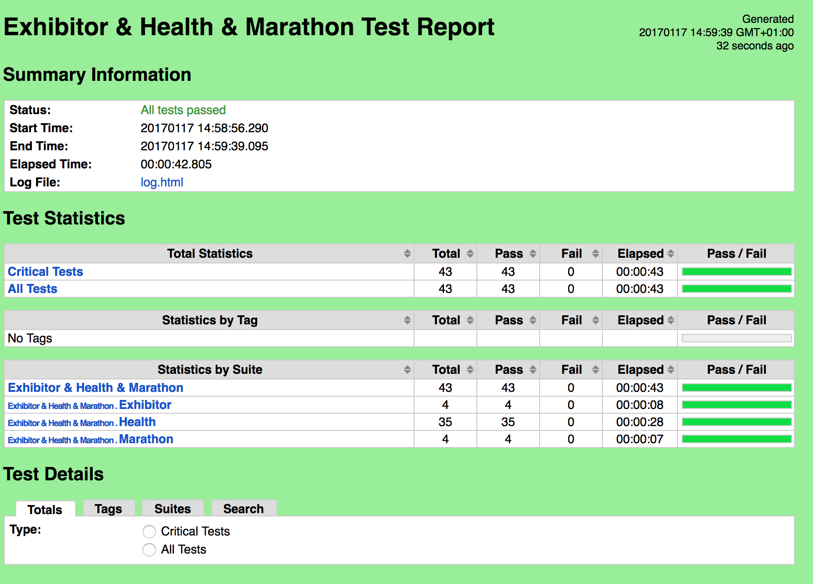
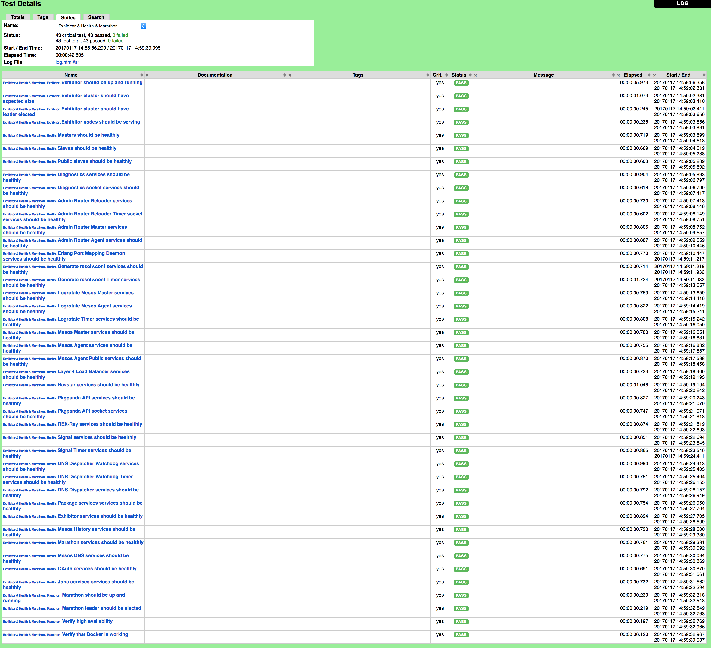
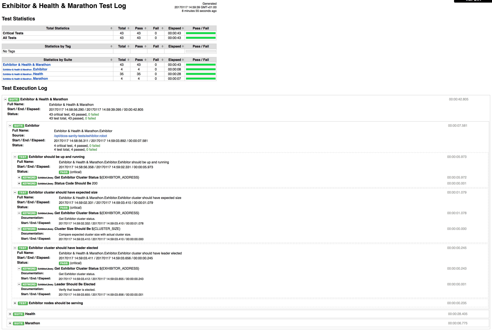

# Ruadan

Ruadan is a set of automated DC/OS sanity tests.



## Getting started

Simply fetch the Docker container for Ruadan:

```
docker pull kamsz/ruadan
```

And run it:

```
docker run -d -e EXHIBITOR_ADDRESS=192.168.1.2 -e MARATHON_ADDRESS=192.168.1.2 -e DCOS_ADDRESS=192.168.1.2 -e CLUSTER_SIZE=3 -p 8000:8000 --name ruadan kamsz/ruadan
```

Test report will be available at http://localhost:8000.

## Docker environment variables

* `EXHIBITOR_ADDRESS` - Hostname or IP address of the Exhibitor instance (or load balancer).
* `MARATHON_ADDRESS` - Hostname or IP address of the Marathon instance (or load balancer).
* `DCOS_ADDRESS` - Hostname or IP address of the DC/OS instance (or load balancer).
* `CLUSTER_SIZE` - Size of the Mesos cluster.

## More images!

### Detailed test report



### Test log



## License

Ruadan is Open Source software released under the [Apache 2.0](LICENSE) license.
